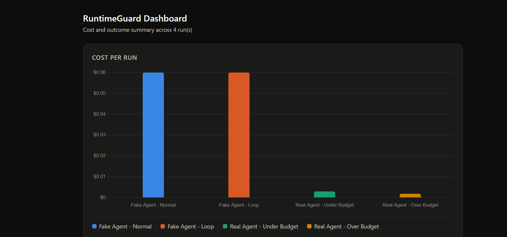

# RuntimeGuard

**A lightweight safety and cost-control supervisor for AI agents.**

RuntimeGuard sits around any AI agent and watches it work — tracking every step, calculating real dollar cost from actual token usage, detecting runaway loops, and automatically stopping the agent before it wastes money or spins out of control.

It doesn't do the agent's job. It watches, protects, and reports.


*(screenshot of reports/dashboard.html — replace with your own after running the demo)*

---

## Why this exists

AI agents are powerful but unpredictable in production. Common failure modes:

- **Runaway loops** - an agent repeats the same action hundreds of times
- **Cost explosions** - a single bad run can cost far more than expected, discovered only after the bill arrives
- **Silent failures** - an agent reports "success" without real visibility into what it actually did
- **No hard stop** - most agents have no built-in way to cut themselves off

RuntimeGuard adds that missing layer: real-time observability, enforced budgets, and an emergency brake - without requiring a heavyweight observability platform.

---

## What it does

- **Step logging** - records every action an agent takes, with timestamps
- **Real cost tracking** - for real Claude API calls, calculates actual dollar cost from real token usage (not estimates)
- **Hard limits** - set a max step count or max cost; RuntimeGuard stops the agent the moment either is crossed
- **Loop detection** - flags and halts an agent that repeats the same action with identical input
- **Human-readable reports** - generates a clean Markdown summary after every run
- **Dashboard** - a single static HTML file visualizing cost and outcome across multiple runs, labeled by project/account

---

## How it works

```
Your task
   ↓
RuntimeGuard starts watching
   ↓
The agent works step by step (plans → acts → calls the LLM)
   ↓
RuntimeGuard checks every step:
   - Logs it
   - Adds to running cost total
   - Checks for repetition
   - Checks against your limits
   ↓
Everything fine → agent finishes → report generated
Limit hit → RuntimeGuard stops the agent immediately → report explains why
```

---

## Quickstart

```bash
git clone https://github.com/Tarunk-32/runtimeguard.git
cd runtimeguard
python -m venv venv
venv\Scripts\activate       # Windows
pip install -r requirements.txt
```

To run the real-agent demos, add an Anthropic API key(Or any GPT you use):

```bash
# create a .env file in the project root:
ANTHROPIC_API_KEY=your-key-here  
```

Then run the full demo:

```bash
python demo.py
```

This runs six scenarios — a normal completion, a step-limit stop, a loop-detection stop, a real Claude-powered run under budget, one over budget, and generates a dashboard at `reports/dashboard.html`.

Run the tests:

```bash
python -m unittest discover tests
```

---

## Example: a real stop in action

```
--- Real agent demo 2/2 (max_cost=0.0015 - expect early stop) ---
Step 1: reasoning_step_1 (calling claude-haiku-4-5)
Step 2: reasoning_step_2 (calling claude-haiku-4-5)
Step 3: reasoning_step_3 (calling claude-haiku-4-5)
Stopping early: max_cost limit reached: $0.0019/$0.0015
Real agent STOPPED EARLY - real cost at stop: $0.001862
```

Real token usage. Real dollar cost. Real enforcement.

---

## Limitations (honest scope)

This is a lightweight, local, single-user tool — not an enterprise observability platform. It's built for individual developers and small teams to understand and control agent behavior, and as a portfolio/learning project demonstrating production-minded AI engineering. It doesn't include multi-user auth, persistent hosted storage, or integrations with tools like Datadog/Splunk - see the "Roadmap" section below for what a Level 2 version would add.

---

## Roadmap (not yet built)

- Ollama integration for a fully free local demo
- Near-duplicate loop detection (embedding similarity, not just exact match)
- Persistent storage (database instead of local files)
- Slack/email alerting on stop events
- Multi-user support

---

## Tech stack

Python · LangChain · Anthropic Claude API · Chart.js (dashboard)

---

## About

Built by Tarun Kumar Kammela as a portfolio project demonstrating production-focused AI engineering - the safety and observability layer that makes agentic AI usable outside of a chat window.
